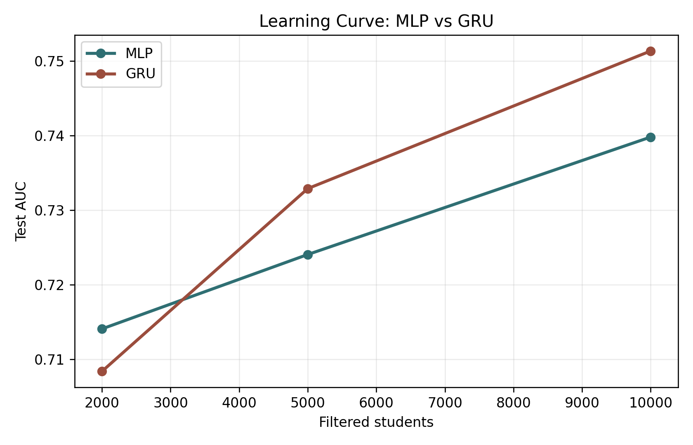
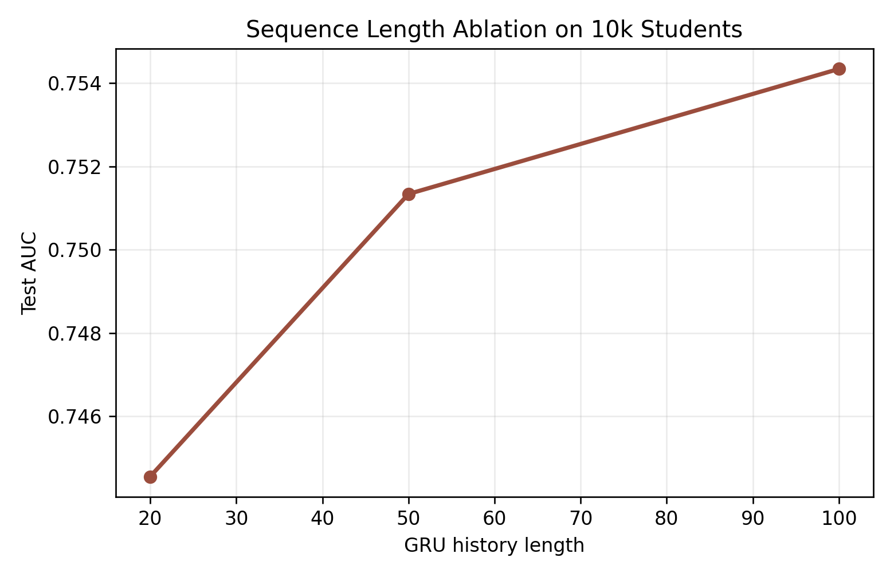
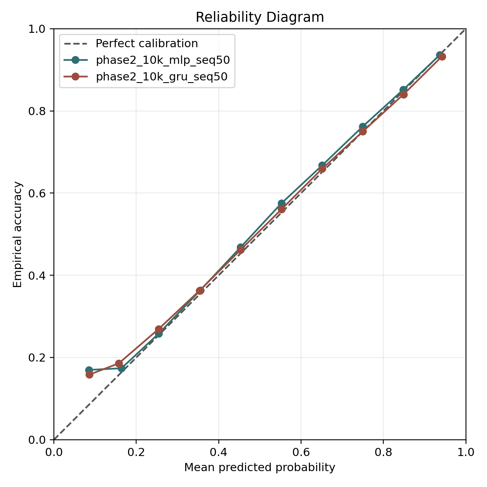

# CS590 Deep Learning Project

This repository implements next-response correctness prediction on EDNet using aggregate-feature MLP and GRU sequence models. The task is to predict whether a student will answer the next question correctly from that student's prior response history.

Raw EDNet data is not included in this repository. To reproduce the experiments, download EDNet separately and point the preprocessing script to the local EDNet-KT1 and question metadata files.

## Project Overview

The project uses EDNet-KT1 response sequences. Each response is aligned with question metadata, and the binary label is defined as:

```text
label = 1 if user_answer == correct_answer, else 0
```

The train, validation, and test splits are made by student rather than by individual response. This avoids placing the same student in both training and test data.

The main model ladder is:

| Model | Purpose |
|---|---|
| Global and question baselines | Estimate task difficulty without neural sequence modeling |
| MLP | Non-sequential neural baseline using aggregate history features and target question information |
| GRU | Sequence model over ordered student response histories |
| GRU ablations | Test the value of longer histories and coarse question metadata |

## Repository Structure

```text
configs/              Example public configs with placeholder data paths
docs/                 Dataset and experiment notes
report_resources/     Report draft, results tables, and selected figures
scripts/              Command-line entry points
src/ednet_project/    Core data, model, training, and evaluation code
```

Generated datasets, checkpoints, raw EDNet files, and full prediction files are intentionally excluded.

## Setup

Install dependencies in a Python environment with PyTorch:

```bash
pip install -r requirements.txt
```

If CUDA is available, install the PyTorch build appropriate for the local machine from the official PyTorch instructions.

## Reproduction

Set these paths to the local EDNet files:

```bash
export KT1_DIR=/path/to/EdNet-KT1/KT1
export QUESTIONS=/path/to/EdNet-Contents/contents/questions.csv
```

Prepare a small sanity-check subset:

```bash
python scripts/prepare_kt1.py \
  --kt1-dir "$KT1_DIR" \
  --questions "$QUESTIONS" \
  --out-dir data/processed/kt1_tiny \
  --target-users 300 \
  --max-raw-users 2500 \
  --min-responses 10
```

Train representative MLP and GRU models:

```bash
python scripts/train_model.py \
  --data-dir data/processed/kt1_tiny \
  --run-name tiny_mlp_seq50 \
  --model mlp \
  --seq-len 50 \
  --epochs 3 \
  --batch-size 512

python scripts/train_model.py \
  --data-dir data/processed/kt1_tiny \
  --run-name tiny_gru_seq50 \
  --model gru \
  --seq-len 50 \
  --epochs 3 \
  --batch-size 512
```

Run summary and calibration analyses after training:

```bash
python scripts/summarize_results.py

python scripts/calibration_analysis.py \
  --data-dir data/processed/kt1_tiny \
  --run tiny_mlp_seq50=results/runs/tiny_mlp_seq50 \
  --run tiny_gru_seq50=results/runs/tiny_gru_seq50 \
  --out-dir results/calibration
```

## Main Results

The main reported experiments compare the MLP and GRU across increasing dataset sizes.

| Dataset scale | Model | Sequence length | Test AUC | Test BCE | Test accuracy |
|---|---|---:|---:|---:|---:|
| 2k students | MLP | 50 | 0.7141 | 0.5722 | 0.7046 |
| 2k students | GRU | 50 | 0.7084 | 0.5792 | 0.7032 |
| 5k students | MLP | 50 | 0.7240 | 0.5756 | 0.6986 |
| 5k students | GRU | 50 | 0.7329 | 0.5706 | 0.7038 |
| 10k students | MLP | 50 | 0.7398 | 0.5570 | 0.7126 |
| 10k students | GRU | 50 | 0.7513 | 0.5482 | 0.7202 |

The scale curve suggests that the aggregate-feature MLP is strong at smaller scale, while the GRU becomes stronger when trained on larger student subsets.

## Ablations

Sequence length ablation on the 10k-student split:

| Model | Sequence length | Test AUC | Test BCE | Test accuracy |
|---|---:|---:|---:|---:|
| GRU | 20 | 0.7446 | 0.5534 | 0.7168 |
| GRU | 50 | 0.7513 | 0.5482 | 0.7202 |
| GRU | 100 | 0.7543 | 0.5461 | 0.7212 |

Metadata ablation on the 10k-student split:

| Model | Metadata setting | Test AUC | Test BCE | Test accuracy |
|---|---|---:|---:|---:|
| GRU seq50 | Includes part and tag metadata | 0.7513 | 0.5482 | 0.7202 |
| GRU seq50 | Removes part and tag metadata | 0.7507 | 0.5491 | 0.7189 |

The metadata ablation suggests that coarse part and tag features contribute little beyond question identity and response-history dynamics.

## Figures

Selected report figures are stored in `report_resources/figures/`.







## Report Resources

The `report_resources/` directory contains:

- `report_draft_for_teammate.md`: a neutral report draft that can be edited into the final writeup.
- `experiment_summary.md`: a compact explanation of the project stages and findings.
- `results_tables/`: CSV tables for main results, ablations, calibration, and bootstrap analysis.
- `figures/`: selected figures for the report and presentation.

## Notes

This repository does not include raw EDNet data or processed student-level datasets. The preprocessing scripts are provided so that the datasets can be rebuilt locally from EDNet.
