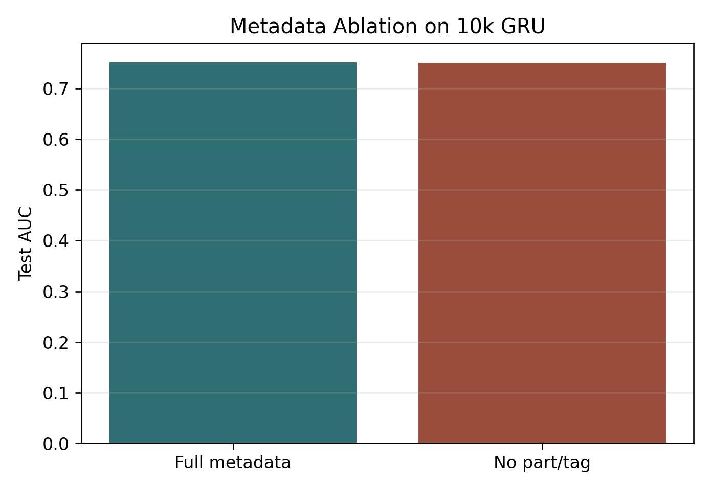

# Predicting Students' Next-Response Correctness from Educational Interaction Sequences

## Abstract

This project studies next-response correctness prediction on EDNet, a large-scale educational interaction dataset. The task is to predict whether a student will answer the next question correctly using that student's prior response history. The project builds a reproducible EDNet-KT1 preprocessing pipeline, compares aggregate-feature MLP baselines with GRU sequence models, and evaluates model performance across increasing data scales. The main finding is scale-dependent: a carefully designed MLP is competitive on a 2k-student subset, while the GRU becomes stronger on 5k and 10k subsets. Additional sequence length, metadata, calibration, and bootstrap analyses are used to interpret the result.

## Problem Formulation

The prediction target is binary next-response correctness. For each student, interactions are sorted by time. The model receives the student's prior response history and predicts whether the next response will be correct. This turns learner modeling into a supervised binary classification problem.

The label is constructed by aligning each response with question metadata:

```text
label = 1 if user_answer == correct_answer
label = 0 otherwise
```

This setup is useful because it evaluates whether a model can use historical educational interactions to estimate a student's future performance.

## Dataset and Preprocessing

The experiments use EDNet-KT1 response logs and EDNet question metadata. KT1 was selected as the main data source because it provides a clean response-sequence setting for next-response prediction. Richer behavior logs are a possible extension, but the main experiments focus on a stable response-sequence pipeline.

The preprocessing pipeline performs the following steps:

1. Read student response files.
2. Sort each student's responses by timestamp.
3. Join responses with question metadata.
4. Compute correctness labels from the submitted and correct answers.
5. Remove invalid rows with missing response or question metadata.
6. Keep students with at least 10 valid responses.
7. Build sequence windows from prior history to next-response label.
8. Split train, validation, and test sets by student.

The student-level split is important because it prevents the same student from appearing in both training and test sets. This reduces leakage and makes the evaluation closer to generalization over held-out students.

| Dataset scale | Students | Responses | Samples | Label rate |
|---|---:|---:|---:|---:|
| 2k | 2,000 | 404,861 | 402,861 | 0.6585 |
| 5k | 5,000 | 1,009,762 | 1,004,762 | 0.6571 |
| 10k | 10,000 | 2,022,208 | 2,012,208 | 0.6537 |

## Model Design

The experiments use a model ladder rather than a single model. This makes it possible to separate simple item-difficulty effects, aggregate learner-history effects, and sequence-modeling effects.

The sanity baselines use global correctness and question-level correctness. These baselines estimate how much performance can be obtained without neural sequence modeling.

The MLP baseline uses aggregate history features and target question information. Aggregate features include cumulative correctness, recent correctness, history length, and elapsed-time summaries. This model is a strong non-sequential baseline because it captures student ability and recent performance without processing the full ordered history.

The GRU model consumes ordered response histories. Historical question identifiers are embedded, previous correctness is included, and optional question metadata can be used. The GRU hidden state is then used to predict the next response correctness. This architecture tests whether sequence order and longer histories add predictive value beyond aggregate features.

## Main Results

The main experiments compare MLP and GRU models at three data scales.

| Dataset scale | Model | Sequence length | Test AUC | Test BCE | Test accuracy |
|---|---|---:|---:|---:|---:|
| 2k students | MLP | 50 | 0.7141 | 0.5722 | 0.7046 |
| 2k students | GRU | 50 | 0.7084 | 0.5792 | 0.7032 |
| 5k students | MLP | 50 | 0.7240 | 0.5756 | 0.6986 |
| 5k students | GRU | 50 | 0.7329 | 0.5706 | 0.7038 |
| 10k students | MLP | 50 | 0.7398 | 0.5570 | 0.7126 |
| 10k students | GRU | 50 | 0.7513 | 0.5482 | 0.7202 |

The 2k result shows that the MLP baseline is strong. This suggests that summary statistics such as prior correctness and question information already capture substantial predictive signal. However, after scaling to 5k and 10k students, the GRU becomes stronger. This indicates that the sequence model benefits more from additional data and can make better use of ordered response histories at larger scale.

The learning curve is one of the central figures for the report because it shows how the model ranking changes with data scale.


## Sequence Length Ablation

The sequence length ablation tests whether the GRU is actually using longer histories.

| Model | Sequence length | Test AUC | Test BCE | Test accuracy |
|---|---:|---:|---:|---:|
| GRU | 20 | 0.7446 | 0.5534 | 0.7168 |
| GRU | 50 | 0.7513 | 0.5482 | 0.7202 |
| GRU | 100 | 0.7543 | 0.5461 | 0.7212 |

Performance improves from sequence length 20 to 50 and again from 50 to 100. This supports the interpretation that longer response histories are useful for the GRU on the 10k-student split.


## Metadata Ablation

The metadata ablation removes coarse part and tag metadata while keeping question identity and response history.

| Model | Metadata setting | Test AUC | Test BCE | Test accuracy |
|---|---|---:|---:|---:|
| GRU seq50 | Includes part and tag metadata | 0.7513 | 0.5482 | 0.7202 |
| GRU seq50 | Removes part and tag metadata | 0.7507 | 0.5491 | 0.7189 |

Removing part and tag metadata changes AUC by only 0.0007. This suggests that coarse metadata is not the main driver of the GRU improvement. The stronger signals appear to come from question identity and the student's response-history dynamics.



## Calibration and Robustness

Because the model outputs probabilities, calibration is also evaluated. The project reports Brier score and Expected Calibration Error in addition to AUC, BCE, accuracy, and F1.

On the 10k split, the GRU has better probability quality than the MLP:

| Model | Brier score | ECE |
|---|---:|---:|
| MLP seq50 | 0.1888 | 0.0119 |
| GRU seq50 | 0.1851 | 0.0079 |


Paired bootstrap analysis is used to estimate the stability of the 10k GRU improvement over the 10k MLP. Positive differences are better for AUC, average precision, accuracy, and F1. Negative differences are better for BCE, Brier score, and ECE.

| Metric | GRU minus MLP | 95 percent confidence interval |
|---|---:|---|
| AUC | +0.0115 | [0.0108, 0.0124] |
| BCE | -0.0088 | [-0.0094, -0.0081] |
| Accuracy | +0.0076 | [0.0064, 0.0087] |
| Brier score | -0.0037 | [-0.0040, -0.0035] |
| ECE | -0.0040 | [-0.0052, -0.0023] |

These intervals indicate that the 10k GRU improvement is stable across bootstrap resamples of the paired test predictions.

## Discussion

The experiments show that architecture comparisons depend on data scale and baseline strength. At smaller scale, aggregate-history features are enough for a strong MLP baseline. At larger scale, the GRU is able to use ordered response histories more effectively and becomes the better model.

The sequence length ablation strengthens this interpretation because longer histories improve GRU performance. The metadata ablation adds another useful interpretation: coarse part and tag metadata do not explain most of the gain. The improvement appears to come primarily from item identity and response-history dynamics.

The calibration results also matter because next-response prediction is naturally probabilistic. A model with better AUC is useful for ranking, but probability quality matters when predictions are interpreted as correctness probabilities. The GRU improves both ranking and calibration metrics on the 10k split.

## Limitations and Future Work

The project focuses on KT1 response sequences. It does not model the full KT4 raw action logs. A natural next step would be to add lightweight behavior summaries before each response, such as recent non-response action counts or activity-density features. This would test whether richer behavioral context improves prediction beyond response history alone.

Another limitation is that the experiments use a controlled subset of EDNet rather than the entire dataset. The pipeline is designed to scale, but the reported results prioritize a clear model comparison and reproducible analysis over exhaustive full-dataset training.

## References

Choi et al. EDNet: A Large-Scale Hierarchical Dataset in Education. https://pmc.ncbi.nlm.nih.gov/articles/PMC7334672/

Piech et al. Deep Knowledge Tracing. https://papers.nips.cc/paper/5654-deep-knowledge-tracing

Guo et al. On Calibration of Modern Neural Networks. https://proceedings.mlr.press/v70/guo17a.html
